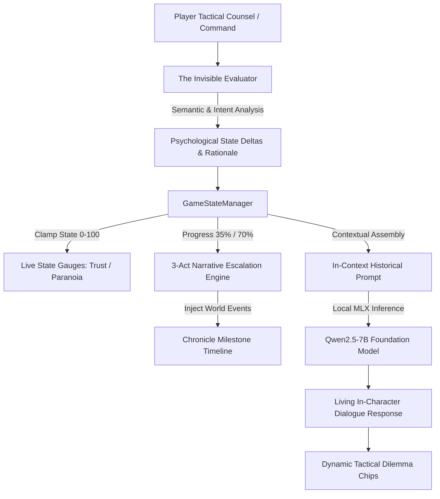

# Historic What-If: Dynamic Narrative Engine

[](https://www.python.org/downloads/)
[](https://github.com/ml-explore/mlx)
[](https://fastapi.tiangolo.com/)
[](https://opensource.org/licenses/MIT)

> **Can your words alter the course of human history?**  
> *Historic What-If* is a local dynamic narrative game powered by local LLMs (`Qwen2.5-7B`), real-time psychological state machines, and an adaptive 3-Act escalation engine.

---

## 🏛️ Overview

Most non-player characters (NPCs) in LLM-powered games suffer from **hallucinations, emotional amnesia, or static dialogue loops**. 

*Historic What-If* solves this by pairing a foundation language model with an **Invisible Evaluator** and a **Finite State Progression Machine**. Every piece of advice, warning, or provocation you deliver shifts the historical figure's psychological state (*Trust, Paranoia, Defiance, Zeal*), alters their tone, unlocks external world events, and steers the timeline toward historical fidelity or radical divergence.

Everything runs **100% locally and privately on Apple Silicon** via Apple's [MLX](https://github.com/ml-explore/mlx) framework.

---

## ⚡ Architecture: The Cognitive Game Loop



---

## 🌟 Key Features

### 1. The Invisible Evaluator
* Analyzes player subtext, rhetoric, and tactical propositions in real time.
* Dynamically calculates mathematical state deltas (`-25` to `+25`) across scenario variables.
* Generates instant psychological rationales (e.g., *"Moctezuma's pulse quickens as Cuitláhuac's war drums echo across Lake Texcoco"*).

### 2. 3-Act Dramatic Narrative Escalation
Historical flashpoints unfold dynamically across three dramatic acts:
* **Act I: The Omen / First Contact** (0–35% Progress): Setting terms, initial scout/senate reports, probing loyalties.
* **Act II: The Crucible / The Ultimatum** (35–70% Progress): The crisis deepens, external world events accelerate, and factional tension spikes.
* **Act III: The Flashpoint / Divergence** (70–100% Progress): Irreversible historical divergence (catastrophe, survival, compromise, or coup).

### 3. Contextual Tactical Dilemma Chips
Replaces generic multiple-choice buttons with high-stakes, historically authentic tactical choices featuring action badges:
* **Act I**: `[SACRED AUGURY]`, `[ROYAL GIFTS]`, `[WAR COUNCIL]`
* **Act II**: `[SEAL CAUSEWAYS]`, `[ISOLATE MALINCHE]`, `[TEMPLO SACRIFICE]`
* **Act III**: `[ROYAL DEFIANCE]`, `[PLEA FOR CALM]`, `[DIVINE OFFERING]`

### 4. 100% Offline & Private on Apple Silicon
* Powered by `mlx-community/Qwen2.5-7B-Instruct-4bit`.
* Instant offline cache loading in `< 1.0s` using unified memory.
* Zero cloud dependencies, zero latency spikes, zero data leaks.

---

## 🗺️ 10 Historical Flashpoints

| Scenario | Figure | Setting | Psychological Poles | Key Dilemma |
| :--- | :--- | :--- | :--- | :--- |
| **The Ides of March** | Julius Caesar | Rome (44 BC) | `Trust` vs `Paranoia` | Will Caesar dismiss the augurs or heed the Senate conspirators? |
| **The Trial of Socrates** | Socrates | Athens (399 BC) | `Compliance` vs `Defiance` | Apologize to the 500 jurors or claim Olympic dining at the Prytaneum? |
| **The Fall of Tenochtitlan** | Moctezuma II | Tenochtitlan (1519) | `Hospitality` vs `Suspicion` | Treat Cortés as Quetzalcoatl or break the Lake Texcoco causeways? |
| **The Gunpowder Plot** | Guy Fawkes | London (1605) | `Defiance` vs `Breaking` | Endure the Tower rack or reveal Robert Catesby's safehouses? |
| **The Salem Witch Trials** | Judge Danforth | Salem (1692) | `Zeal` vs `Doubt` | Uphold spectral evidence or halt the executions on Gallows Hill? |
| **The Last Romanovs** | Yakov Yurovsky | Yekaterinburg (1918) | `Loyalty` vs `Greed` | Execute the Ural Soviet decree or seize the hidden imperial jewels? |
| **Operation Valkyrie** | General Fromm | Berlin (1944) | `Courage` vs `Fear` | Authorize the Reserve Army coup or wait for Keitel's telephone line? |
| **Surrender at Appomattox**| General Robert E. Lee| Virginia (1865) | `Honor` vs `Desperation` | Accept Grant's parole terms or scatter into guerrilla bushwhacking? |
| **Sarajevo Flashpoint** | Franz Ferdinand | Sarajevo (1914) | `Stubbornness` vs `Panic` | Reverse the motorcade at Schiller's or proceed into Princip's sights? |
| **Cuban Missile Crisis** | John F. Kennedy | Washington (1962) | `Diplomacy` vs `Hawkishness`| Order an air strike on Cuba or execute the secret Turkey missile trade? |

---

## 🚀 Quickstart

### Prerequisites
* Apple Silicon Mac (M1/M2/M3/M4) with macOS 13.0+.
* Python 3.10, 3.11, 3.12, or 3.14.

### 1. Installation

```bash
# Clone this repository
git clone https://github.com/your-username/historic-what-if-engine.git
cd historic-what-if-engine

# Create virtual environment and install dependencies
python3 -m venv .venv
source .venv/bin/activate
pip install -r requirements.txt
```

### 2. Launch the Game

Run the one-click launcher:

```bash
./start_game.sh
```

This automatically launches:
* **FastAPI Backend**: `http://127.0.0.1:8000`
* **Web Client**: `http://localhost:8080` (opens automatically in your browser)

---

## 📂 Project Structure

```
historic-what-if-engine/
├── api/
│   ├── server.py             # FastAPI REST endpoints & local inference loop
│   ├── game_state.py          # GameStateManager (3-Act engine & state clamping)
│   ├── evaluator.py           # The Invisible Evaluator (semantic intent matching)
│   └── test_game.py           # Automated test suite (all 5 core engine tests)
├── client/
│   ├── index.html             # Historical dark-mode interface
│   ├── style.css              # Glassmorphism, Cinzel typography, glowing meters
│   ├── app.js                 # Client-side state manager & event handling
│   └── assets/                # 10 authentic period background scenes (16:9)
├── scenario_data.py           # Ground Truth Matrix, 3-Act maps, & character prompts
├── start_game.sh              # One-click executable launcher
├── requirements.txt           # Minimal runtime dependencies
└── README.md                  # Documentation
```

---

## 🧪 Testing & Verification

To run the automated verification suite:

```bash
python api/test_game.py
```

Expected output:
```text
✓ StateEvaluator intent tests passed!
✓ GameStateManager transition & milestone tests passed!
✓ GET /scenarios catalog tests passed (10 scenarios)!
✓ POST /scenario/start endpoint tests passed!
✓ POST /chat full game loop tests passed!

ALL VERIFICATION TESTS PASSED SUCCESSFULLY!
```

---

## 📄 License

MIT License. Free to use, adapt, and build upon for educational and game development research.
